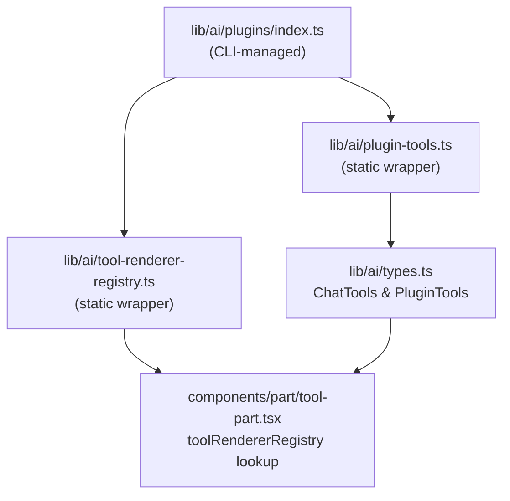

> Build a self-contained tool plugin that the `chatjs add` CLI command can install into any ChatJS project.

## Overview

The plugin system lets you package a backend AI tool and its frontend renderer as a distributable unit. Once installed, the tool is available to the AI model and its output is rendered with your custom component -- with full TypeScript type safety end to end.

This recipe covers how the system works and what files make up a plugin.

## How it works

Installing a plugin does three things:

1. Copies the tool implementation and renderer into the project
2. Injects the plugin into `lib/ai/plugins/index.ts`, the single file the CLI manages
3. The static wrappers (`plugin-tools.ts`, `tool-renderer-registry.ts`) automatically pick up the new entries



## File structure

A plugin ships three files. The CLI copies two of them and injects entries for all three into the registry index.

| File | What it contains |
|------|-----------------|
| `lib/ai/tools/plugins/{name}.ts` | Backend tool: schema + `execute` function |
| `components/part/plugins/{name}.tsx` | Frontend renderer component |
| `lib/ai/plugins/index.ts` | Registry index -- CLI injects imports and entries here |

## Code

### 1. Backend tool

```ts title="lib/ai/tools/plugins/word-count.ts"
import { tool } from "ai";
import { z } from "zod";

export const wordCount = tool({
  description: "Count the words, characters, and sentences in a given text",
  inputSchema: z.object({
    text: z.string().describe("The text to analyze"),
  }),
  execute: async ({ text }: { text: string }) => {
    const words = text.trim() === "" ? 0 : text.trim().split(/\s+/).length;
    const characters = text.length;
    const charactersNoSpaces = text.replace(/\s/g, "").length;
    const sentences = text
      .split(/[.!?]+/)
      .filter((s) => s.trim().length > 0).length;

    return { words, characters, charactersNoSpaces, sentences };
  },
});
```

### 2. Frontend renderer

The renderer receives `PluginToolRendererProps`. Use `Extract` to narrow the union to your specific tool type and get typed `input` and `output`.

```tsx title="components/part/plugins/word-count.tsx"
"use client";

import type { ToolUIPart } from "ai";
import type { PluginToolRendererProps } from "@/lib/ai/tool-renderer-registry";
import type { ChatTools } from "@/lib/ai/types";

type WordCountPart = Extract<ToolUIPart<ChatTools>, { type: "tool-wordCount" }>;

export function WordCountRenderer({ tool }: PluginToolRendererProps) {
  const part = tool as WordCountPart;

  if (part.state === "input-available") {
    return (
      <div className="text-muted-foreground rounded-lg border p-3 text-sm">
        Counting words...
      </div>
    );
  }

  if (part.state !== "output-available") {
    return null;
  }

  const { words, characters, charactersNoSpaces, sentences } = part.output;

  return (
    <div className="grid grid-cols-2 gap-2 rounded-lg border p-3 text-sm sm:grid-cols-4">
      <div className="flex flex-col items-center gap-1">
        <span className="font-semibold text-lg">{words}</span>
        <span className="text-muted-foreground text-xs">Words</span>
      </div>
      <div className="flex flex-col items-center gap-1">
        <span className="font-semibold text-lg">{characters}</span>
        <span className="text-muted-foreground text-xs">Characters</span>
      </div>
      <div className="flex flex-col items-center gap-1">
        <span className="font-semibold text-lg">{charactersNoSpaces}</span>
        <span className="text-muted-foreground text-xs">No spaces</span>
      </div>
      <div className="flex flex-col items-center gap-1">
        <span className="font-semibold text-lg">{sentences}</span>
        <span className="text-muted-foreground text-xs">Sentences</span>
      </div>
    </div>
  );
}
```

### 3. Registry index (CLI-managed)

The CLI appends one import and one entry per plugin to each of the three managed blocks. You do not edit this file manually.

```ts title="lib/ai/plugins/index.ts"
// [chatjs-registry:imports]
import { WordCountRenderer } from "@/components/part/plugins/word-count";
import { wordCount } from "@/lib/ai/tools/plugins/word-count";
// [/chatjs-registry:imports]

export const tools = {
  // [chatjs-registry:tools]
  wordCount,
  // [/chatjs-registry:tools]
} as const;

export const renderers = {
  // [chatjs-registry:renderers]
  "tool-wordCount": WordCountRenderer,
  // [/chatjs-registry:renderers]
};
```

## Type flow

`plugin-tools.ts` derives `PluginTools` from the `tools` export via a mapped `InferUITool` type. `types.ts` intersects this with the built-in `ChatTools`, so plugin tools become first-class typed members of the union.

```
tools (as const) → PluginTools → ChatTools & PluginTools → ToolUIPart<ChatTools>
```

This means `part.output` inside your renderer is fully typed -- no `unknown`, no manual casts beyond the initial `Extract` narrowing.

## Path configuration

The CLI reads `paths` from `chat.config.ts` to know where to copy files and which import aliases to write into the registry index. The defaults match the out-of-the-box project layout.

```ts title="chat.config.ts"
export default defineConfig({
  // ...
  paths: {
    plugins:     "@/lib/ai/plugins",
    toolPlugins: "@/lib/ai/tools/plugins",
    partPlugins: "@/components/part/plugins",
  },
});
```

## Registry manifest

When you publish a plugin to a registry, the manifest tells the CLI which files to copy and what entries to inject.

```json
{
  "name": "word-count",
  "files": [
    { "type": "tool",     "path": "word-count.ts"  },
    { "type": "renderer", "path": "word-count.tsx" }
  ],
  "registry": {
    "toolExport":     "wordCount",
    "rendererExport": "WordCountRenderer",
    "rendererKey":    "tool-wordCount"
  }
}
```

## Related

- [Tool Part](/cookbook/tool-part) -- how built-in tools connect a backend definition to a frontend component
